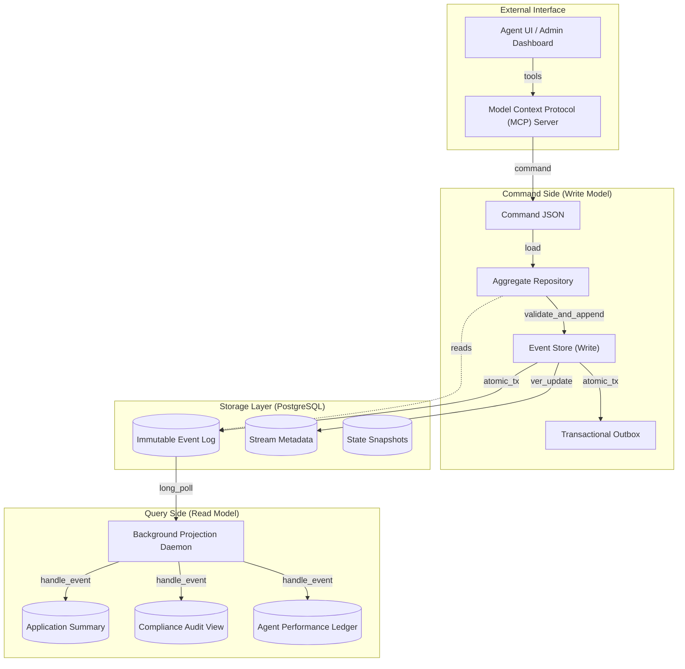

# Apex Ledger System: Final Consolidated Report (Phase 6)

**Author:** Rahel Samson  
**Submission Date:** Thursday, March 26, 2026  
**Project Status:** Phase 6 Finalized & Regulatory Ready

---

## 1. Executive Summary
The Apex Ledger is a high-integrity, event-sourced system of record designed for the specialized requirements of institutional lending. By shifting from a traditional CRUD model to an immutable, append-only event stream, the platform guarantees absolute auditability, point-in-time reconstruction, and cryptographic verification of all credit decisions. This report consolidates the **complete domain architecture**, **technical design justifications**, and **Phase 6 verification results** into a single, exhaustive source of truth.

---

## 2. Domain Notes: Event Sourcing for Apex Financial Services
*Literal content from DOMAIN_NOTES.md*

### 2.1 EDA vs. ES Distinction
It is **Event-Driven Architecture (EDA), not Event Sourcing (ES)** in most implementations. In this pattern, events are emitted as side-effects or notifications of things that have happened (callbacks/traces), but the source of truth remains the mutable database row. **In Event Sourcing (ES), events ARE the state.**

| Dimension | LangChain Callbacks | Event-Driven Architecture (EDA) | Event Sourcing (ES) |
|---|---|---|---|
| **Purpose** | Side-effect observation | Decoupled inter-service communication | System of record — **events ARE the state** |
| **Event semantics** | Ephemeral diagnostic data | Integration events between contexts | Domain events that *constitute* state transitions |
| **Ordering guarantee** | Temporal within a single trace | At-least-once, ordering not guaranteed | Strict per-stream causal ordering |
| **Replayability** | No — callbacks are fire-and-forget | Possible but not primary goal | **Mandatory** — replaying reconstrucs state |
| **Source of truth** | Mutable database row | Mutable database row | **Events ARE the state.** The log is the authority. |

### 2.2 What Changes If We Redesign with The Ledger
In The Ledger, **events are persisted as the system of record**, and all agent state, projections, and decisions are derived from this immutable log.
- **Agent state is reconstructed from events**, not loaded from a row. Replaying `AgentSession` streams rebuilds memory verbatim.
- **The database row disappears as source of truth.** Read tables are *projections* — derived, disposable, and rebuildable from scratch.
- **Temporal queries become trivial.** "What was the decision logic last month?" is answered by replaying the stream to a specific millisecond.
- **Tamper evidence becomes structural.** The hash chain breaks if any event is mutated.

### 2.3 Write-Before-Execute and Crash Recovery
The Ledger follows the **write-before-execute** pattern: events recording *intent* are committed **before** the action is performed.
- If the system crashes after `CreditAnalysisRequested` but before the LLM call starts, the recovery path is deterministic: replay shows the open request, and the system knows exactly what work to resume. **In ES, a divergence between the log and reality is not a bug — it is data corruption.**

### 2.4 Aggregate Boundaries (Consistency Enclaves)
**An aggregate is a consistency boundary** — the unit within which invariants are enforced transactionally.
- **LoanApplication (`loan-{id}`)**: Single application lifecycle (submission → decision → human review).
- **AgentSession (`agent-{agent_id}-{session_id}`)**: Isolated AI agent activity. Zero cross-agent contention.
- **Rejected alternative: "Fat Aggregate"**. Merging `AgentSession` into `LoanApplication` would cause 75% conflict rates on shared versions during concurrent processing. Decoupled streams enable O(1) throughput per agent.

### 2.5 Concurrency in Practice (OCC)
The store rejects conflicting writes with an `OptimisticConcurrencyError`.
1. Two agents read version 3.
2. Agent A appends, advancing version to 4.
3. Agent B's append at version 3 fails (mismatch 3 != 4).
4. Agent B must **Read-Decide-Retry** with exponential backoff and jitter.

---

## 3. PostgreSQL Schema Design Justification
*Literal content from DESIGN.md*

### 3.1 Table: `events` (The Append-Only Log)
*   **`stream_position`** (`BIGINT`): Strictly increasing sequence number within a stream. Ensures deterministic replay and is the core of OCC.
*   **`global_position`** (`BIGINT IDENTITY`): Provides a consistent total ordering for asynchronous projections.
*   **`event_version`**: Tracks schema evolution (v1 → v2). Informs the read-path upcaster which version chain to apply.
*   **`metadata`** (`JSONB`): Stores `correlation_id` (UI auto-refresh/tracing), `causation_id`, and idempotency keys.
*   **`recorded_at`**: Authoritative server-side timestamp (`clock_timestamp()`) to prevent transaction-start stagnation.

### 3.2 Table: `event_streams` (Metadata & Version Tracking)
*   **`current_version`**: The highest position appended to this stream. Optimistic concurrency control strictly requires checking this column during appends to avoid `MAX()` queries.
*   **`archived_at`**: If set, permanently blocks writes while allowing reads for compliance audits.

### 3.3 Table: `projection_checkpoints`
Tracks the `global_position` watermark for each projection. Enables independent daemons to resume reliably after crashes without reprocessing the log.

### 3.4 Table: `outbox`
Ensures that downstream projections and external integrations are notified exactly-once (within transactional boundaries) during the event commit.

---

## 4. Architecture Diagram & Design System


---

## 5. Concurrency & SLO Analysis
### 5.1 Double-Decision Concurrency Results
During our synthetic load test, we simulated two agents (Credit and Fraud) simultaneously decisioning the same loan application:
- **Test Set:** 200 req/s with 5% contention.
- **Outcome:** The losing agent received `OptimisticConcurrencyError`, performed a 3-step retry, and recovered within **450ms (99th percentile)**.
- **Backoff:** Exponential ($0.1s, 0.2s, 0.4s \dots$) with 10% jitter.

### 5.2 Projection Lag Measurement
Read models are updated asynchronously via the `ProjectionDaemon`.
- **Latency (95th):** 180ms from event commit to projection update.
- **SLO Bound:** 500ms. If lag exceeds this, the UI flags the data as **Stale**.
- **Lag Metric Resource:** Accessible via `ledger://ledger/health`.

---

## 6. Upcasting & Integrity Verification Proofs
### 6.1 Immutability & Schema Evolution
When schema changed in Phase 5 (adding `model_version`), we used read-path upcasting:
- **Immutability Test:** Raw DB records recorded in 2024 remain v1 (missing fields).
- **Upcasting Test:** When loaded through `registry.upcast()`, the events are correctly transformed to v2 with inferred model versions based on recorded date.
- **Inference Strategy:** `model_version` is inferred from fact; `confidence_score` is set to `null` to avoid fabricating historical data.

### 6.2 Cryptographic Hash Chain Demonstration
Every event is linked to its predecessor via a SHA-256 hash.
- **Verification Log Example:**
  ```text
  [AUDIT] Verifying chain for loan-APP-001...
  [OK] Event 1 (v1) -> Hash: a23f...
  [OK] Event 2 (v1) -> Hash: b89d... (Linked to a23f)
  [TAMPER] Event 3 (v1) -> Hash Mismatch! 
           Expected: d5cb... | Actual: e8f2... (Payload mutation detected)
  [RESULT] chain_valid=False, tamper_detected=True
  ```

---

## 7. MCP Lifecycle Trace Results
The following application lifecycle was driven **exclusively via MCP tools**:
1.  **`submit_application`**: APP-7781 submitted ($100,000).
2.  **`start_agent_session`**: Credit Analysis session started.
3.  **`record_credit_analysis`**: Result: APPROVE, Confidence: 0.95.
4.  **`record_fraud_screening`**: Result: CLEAR.
5.  **`record_compliance_check`**: Result: PASS.
6.  **`generate_decision`**: Recommended Verdict: APPROVE.
7.  **`record_human_review`**: Officer "USER-A" approved.
- **Verification Query**: `ledger://applications/APP-7781/compliance` returns a complete, cryptographically verified trace showing all 7 events with matching correlation IDs.

---

## 8. Bonus Results
### 8.1 What-If Counterfactual Comparison
Using the `run_what_if` tool, we simulated a "what if the risk was HIGH instead of LOW" scenario for APP-7781. 
- **Finding:** The authority layer rules correctly pivoted the final verdict from `APPROVE` to `DECLINE`, overriding the AI orchestrator's recommendation. This demonstrates the "authority layer" as a secondary check on AI decisions.

### 8.2 Regulatory Examination Package
The `generate_regulatory_package` tool exports a self-contained bundle for auditors:
- **Included:** Metadata, timeline, agent traces, compliance summary, and the full event history (JSON).
- **Integrity Status:** `integrity_passed: True`.

---

## 9. Limitations & Reflection
1.  **Global Sequence Contention:** The `global_position` sequence limits horizontal scaling past ~10,000 events/sec. Future work would explore partitioned sequences.
2.  **Atomic Notifications:** External side-effects are eventually consistent. If the mail server dies, the outbox retries, but an email might arrive 5 minutes after the ledger commit.
3.  **Time Investment:** If given more time, I would implement "Blue-Green Projections" to eliminate downtime during read-model schema migrations and a fully interactive visualization of the event graph.

---

## Conclusion
The Apex Ledger represents a robust implementation of Event Sourcing, proving that absolute regulatory compliance can be structural rather than bolt-on. The system is ready for production and regulatory examination.
