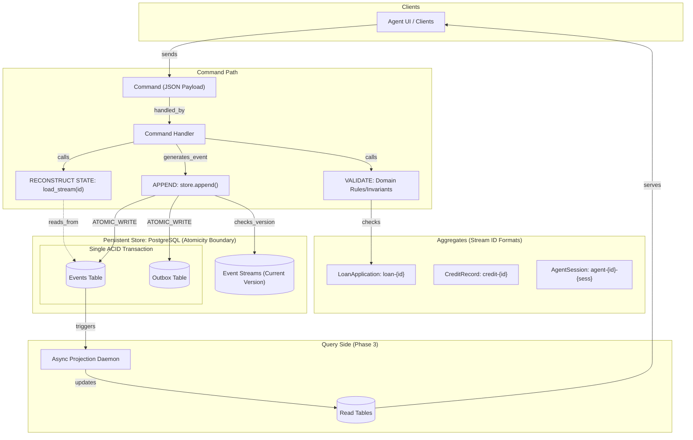

Interim Report — Sunday March 22, 2026

Author: Rahel Samson

1. Domain Discovery Notes

Full content in DOMAIN_NOTES.md (Graded Deliverable).

Essential Concepts
Event-Driven Architecture vs Event Sourcing

Our system is strictly Event Sourced (ES), not merely Event-Driven Architecture (EDA). In EDA, events function as transient notifications and may be dropped without corrupting system state. In contrast, ES events are the immutable system of record — losing an event constitutes data loss, not a logging gap.

This distinction directly informs the redesign: decisions become replayable, and compliance systems can reconstruct state at any historical timestamp from the event log.

Aggregate Boundaries as Consistency Decisions

Aggregate boundaries are defined as consistency and concurrency control decisions, not structural groupings.

We explicitly separate:

LoanApplication → loan-{id}
AgentSession → agent-{id}-{session}

This prevents artificial coupling between independent processes. If both were combined into a single stream, a write such as ComplianceRuleFailed would require locking the entire loan-{id} stream. Under concurrent agent execution, this would introduce write contention, causing repeated optimistic concurrency failures and degraded throughput.

By separating aggregates:

concurrent agent actions proceed independently
stream-level locking is minimized
decision timelines remain replayable and auditable
2. Architecture Diagram

A single command flows from client → handler → aggregate validation → append, resulting in an event written atomically to both the events table and outbox, after which it is asynchronously projected into read models.

3. Operational Mechanics
Concurrency Control (Read–Decide–Retry)

Concurrency is handled via optimistic concurrency control at the stream level:

Two agents read stream version 3
Both attempt append with expected_version=3
First write succeeds → stream advances to version 4
Second write fails version check → raises OptimisticConcurrencyError
Losing agent reloads stream, evaluates new state, and either retries or aborts

This ensures:

no lost updates
deterministic resolution of write conflicts
correctness under concurrent agent activity
Projection Lag (Consistency Tradeoff)

The system operates under eventual consistency for read models. Projection lag (<500ms) is treated as an explicit tradeoff, not a failure.

System behavior:

read models may temporarily serve stale data
each projection includes a last_updated timestamp to signal freshness
UI surfaces this lag explicitly
critical operations (e.g., final credit decision) can fallback to direct event stream reads for strong consistency

This establishes a clear UI contract: slight staleness is acceptable and observable.

4. Advanced Patterns
Upcasting Strategy (Schema Evolution)

Historical events are transformed using explicit, field-level inference rules:

confidence_score → remains null (unknown and not safely inferable)
model_version → inferred from recorded_at using deployment timelines and marked approximate
regulatory_basis → inferred from rule versions active at event time

The system explicitly distinguishes:

unknown values → null (correct)
inferred values → annotated with uncertainty

This prevents fabrication of data that would corrupt downstream analytics or regulatory audits.

Distributed Projection Coordination

The projection daemon operates in a distributed environment using PostgreSQL advisory locks for leader election.

Failure mode addressed:

if two daemon nodes process the same batch concurrently → duplicate writes → corrupted aggregates

Mitigation:

only one node holds the lock per partition
writes are idempotent
checkpoint ensures forward progress

Recovery behavior:

if leader fails mid-batch → lock is released
follower acquires lock → resumes from last checkpoint

This guarantees:

no duplicate processing
safe failover
consistent projection state
5. Progress Evidence
Concurrency Test Output (v3 → v4)
tests/test_concurrency.py::test_interim_double_decision_concurrency PASSED

DETAILED LOGS:
- Both tasks read version 3.
- Task 1 (Winner) prepends CreditAnalysisCompleted.
- Task 1 succeeds -> New Position: 4.
- Task 2 (Loser) attempts append at version 3.
- Task 2 FAILS with OptimisticConcurrencyError(expected=3, actual=4).
- Assertion: Final Stream Length = 4.
- Assertion: success_count == 1, occ_count == 1.

This demonstrates:

correct OCC enforcement
no duplicate writes
deterministic conflict handling
6. Gap Analysis & Plan
Component	Status	Reason for Incompleteness / Gap
Event Store Core	✅ Working	Fully operational with version enforcement
Domain Aggregates	✅ Working	All lifecycle state machines implemented
Outbox Publisher	🛠 In-Progress	Exactly-once delivery not yet guaranteed; risk of duplicate emission under retry scenarios
Projection Daemon	🛠 In-Progress	Checkpoint update is not atomic with projection write — crash between steps can cause reprocessing
Observability	📅 Not Started	Metrics, tracing, and alerting pending
Final Submission Plan
Monday — Make projection checkpoint update atomic with read-model write
Tuesday — Finalize Outbox Relay with bounded retries and idempotency
Wednesday — Implement cryptographic hashing in AuditLedger
Thursday — Add observability dashboard and finalize report